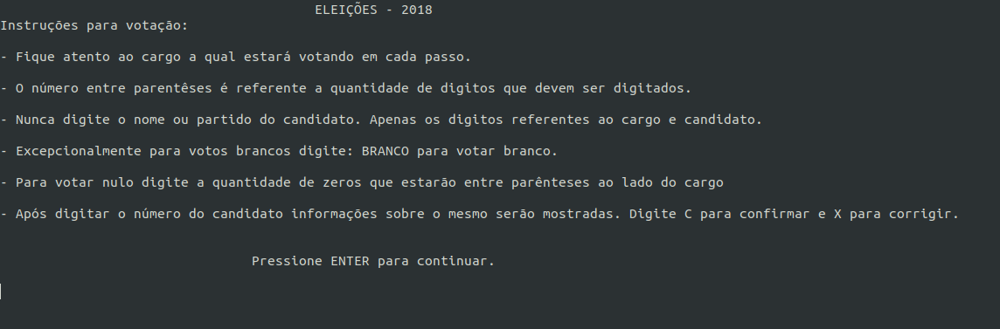

# Eleições 2018 - Urna para o Distrito Federal

Simulador de uma urna eletrônica desenvolvido em c++. //ou c+- risos

Como utilizar?

## Compilar o programa
Para compilar é necessário que um compilador esteja instalado na máquina. Segue abaixo como instalar o compilar g++:
## Debian Based
> `sudo apt get install g++`

## macOS
> `g++`

Caso queira instalar em uma distro não baseada em Debian ou até mesmo no Windows pesquise por:
"Como instalar o g++ no/na Distro/Windows X"
##Criando cópia:
Digite no terminal:
> `git clone http://gitlab.com/pedroigor.silva/ep01`
Para entrar na pasta criada:
> `cd ep01`
## Executando:
## Limpar arquivos temporários:

> `make clean`

## Criar Executável do Urna:

> `make`

## Iniciar a Urna:

> `make run`

## Primeiro passo: Digitar a quantidade de eleitores que participarão da sessão:

## Segundo passo: Digitar o nome do eleitor que irá votar:

## Será mostrada uma tela de informações para a votação:

## Terceiro passo: Digitar o código para votar em cada candidato/cargo:

## É possível votar nulo:

## E também branco:

## Após digitar o código do candidato é possível visualizar suas informações e confirmar/cancelar o voto:

## Caso o cargo tenha vice ou suplente é possível também visualizar o nome do candidato a vice/suplente:

## Após terminar a sessão de cada eleitor é mostrada uma tela de confirmação de participação:

## Após terminar todas as sessões é mostrado um relatório de voto das pessoas e o resultado da eleição:

##Bugs e Problemas
Ainda não foram relatados. Porém caso encontre, sinta-se a vontade em corrigir/relatar.
##Referências
